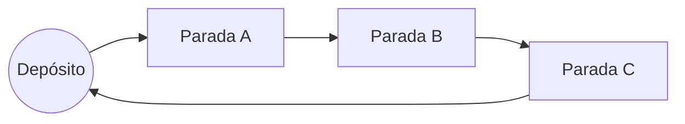

Sabor Express
=============

Aplicativo web (Flask) para geração de rotas de entrega, iniciando e finalizando no ponto da loja (depósito). Exibe a ordem da rota, um mapa com o traçado, um grafo simples e permite exportar a rota como CSV.

Problema, desafio e objetivos
----------------------------
Definir manualmente uma ordem eficiente de visita para vários endereços é difícil e demorado. O objetivo é reduzir distância e tempo totais com uma solução prática: carregar pontos, escolher quais entram na rota, definir a velocidade do entregador, otimizar, visualizar e exportar.

Abordagem adotada
-----------------
Modelamos o problema como um TSP (caixeiro viajante) em ciclo com retorno ao depósito. Usamos heurísticas clássicas:
- Vizinho Mais Próximo (construção): a partir da origem, escolhe sempre o ponto não visitado mais próximo.
- 2‑OPT (refino local): realiza trocas de arestas para remover cruzamentos e encurtar o caminho.

As distâncias são calculadas por Haversine (km). Opcionalmente, usamos o OSRM (público) para obter a polilinha pelas ruas e, quando disponível, a distância viária por perna. O tempo sempre é calculado por `tempo_min = (dist_km / velocidade_kmh) * 60`, usando a velocidade informada pelo usuário.

Algoritmos de IA clássica
-------------------------
- Heurística de TSP: Vizinho Mais Próximo + 2‑OPT (busca local).
- Geodesia: distância de Haversine para compor a matriz de distâncias.
Observação: A*, BFS, DFS e K‑Means também são clássicos úteis. Uma extensão natural é K‑Means para clusterizar pontos e aplicar TSP por cluster em cenários grandes.

Diagrama do grafo (conceitual)
------------------------------


Resultados, eficiência, limitações e melhorias
---------------------------------------------
- Resultados: NN + 2‑OPT gera rotas curtas rapidamente e melhora muito em relação a uma ordem arbitrária.
- Eficiência: NN é O(n^2); 2‑OPT costuma terminar em ms/s para dezenas/baixas centenas de pontos, adequado ao uso diário.
- Limitações:
  - Não trata janelas de tempo, capacidades ou múltiplos entregadores (VRP).
  - OSRM público pode ter limites; quando indisponível, o mapa usa linhas retas (Haversine) só para visualização.
  - Heurística não garante ótimo global (2‑OPT reduz bem o custo, mas não prova otimalidade).
- Melhorias sugeridas:
  - K‑Means + TSP por cluster para escalar.
  - VRP (múltiplos entregadores, capacidades) e janelas de tempo (VRPTW).
  - Priorização de paradas e restrições de serviço.
  - Cache de matrizes por região para acelerar cenários repetitivos.

Estrutura do projeto
--------------------
- `app/web.py` — servidor Flask (rotas, orquestração e renderização).
- `app/core/geo.py` — Haversine, matriz de distâncias, estimativa de tempo.
- `app/core/optimizer.py` — TSP heurístico (NN + 2‑OPT).
- `app/core/data.py` — leitura/gravação de CSV (sem dependências pesadas).
- `app/ui/components.py` — mapa Folium e grafo Plotly.
- `templates/` — páginas HTML (tema escuro): `index.html`, `result.html`, `base.html`.
- `data/enderecos.csv` — base de exemplo e persistência dos cadastros.
- `requirements.txt` — dependências.

Como executar
-------------
1) Instale dependências:
```
pip install -r requirements.txt
```
2) Rode o servidor:
```
python -m app.web
```
Acesse `http://localhost:8000`.

3) Uso:
- Preencha dados do Sabor Express (nome/lat/lon), endereço opcional e velocidade (km/h).
- Adicione/edite/exclua pontos e marque `selecionado` para entrar na rota.
- (Opcional) marque “traçar rota pelas ruas (OSRM)” para desenhar o trajeto real no mapa.
- Clique em “Calcular melhor rota” para ver ordem, totais, mapa e grafo; baixe o CSV.
- Clique em “Salvar cadastros” para gravar `data/enderecos.csv` e reutilizar depois.

Formato de CSV
--------------
Cabeçalho recomendado:
```
id,nome,endereco,latitude,longitude,selecionado
```
Sinônimos aceitos (case-insensitive): `endereco/address/rua`, `lat/latitude`, `lon/lng/longitude`, `selecionado/selected/ativo`.

Licença
-------
Uso educacional/demonstração.